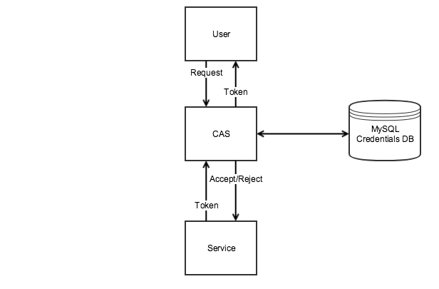

# Connected Vehicles SSO Webapp Project

The fedgov-cv-sso-webapp project is a webapp which contains the configuration and code to run CAS for authentication to allow access
to other webapps.




<a name="toc"/>

## Table of Contents

[I. Release Notes](#release-notes)

[II. Documentation](#documentation)

[III. Getting Started](#getting-started)

[IV. Configuration](#configuration)

[V. Running the Application (Standalone)](#running-standalone)

[VI. Running the Application (Docker)](#running-docker)

---

<a name="release-notes" id="release-notes"/>

## [I. Release Notes](ReleaseNotes.md)

<a name="documentation"/>

## II. Documentation

This repository produces a WAR file containing a Servlet, so it can be deployed on any web-server that supports it (e.g. Tomcat, Jetty).

The application can also be deployed using a docker container. This container will run the application under a Jetty server, and can be configured to use SSL certificates.

<a name="getting-started"/>

## III. Getting Started

The following instructions describe the procedure to fetch, build, and run the application

### Prerequisites
* JDK 1.8: http://www.oracle.com/technetwork/pt/java/javase/downloads/jdk8-downloads-2133151.html
* Maven: https://maven.apache.org/install.html
* Git: https://git-scm.com/
* Docker: https://docs.docker.com/engine/installation/

---
### Obtain the Source Code

#### Step 1 - Clone public repository

Clone the source code from the GitHub repository using Git command:

```bash
git clone TBD
```

<a name="configuration"/>

## IV. Configuration

The servlet expects the following java properties to be set:

* sso.auth.mysql.url - Url to the MySQL credentials database
* sso.auth.mysql.username - Username For the MySQL credentials database
* sso.auth.mysql.password - Password For the MySQL credentials database

Through spring, these will automatically be set to the matching SNAKE_CASE environment variable, i.e. SSO_AUTH_MYSQL_URL 

<a name="running"/>

## V. Running the application (Standalone)

---
### Build and Deploy the Application

**Step 1**: Build the WAR file

```bash
mvn package
```

**Step 2**: Deploy the WAR file

```bash
# Consult your webserver's documentation for instructions on deploying war files 
cp target/accounts.war ... 
```

<a name="running-docker"/>

## VI. Running the Application (Docker)

---
### Build and Deploy the Application

**Step 1**: Build the WAR file

```bash
mvn package
```

**Step 2**: Build the Docker image, providing the path to the native library for the PER-XER codec

```bash
docker build -t dotcv/webapp-sso .
```

**Step 3**: Run the Docker image in a Container, mounting the SSL certificate keystore directory, and specifying the following:
* Keystore filename
* Keystore password
* HTTP Port
* HTTPS Port


```bash
docker run -p HTTP_PORT:8080 \
           -p HTTPS_PORT:8443 \
           -e JETTY_KEYSTORE_PASSWORD=... \
           -v KEYSTORE_DIRECTORY:/usr/local/jetty/etc/keystore_mount \
           -e JETTY_KEYSTORE_RELATIVE_PATH=... \
           -e SSO_AUTH_MYSQL_URL=... \
           -e SSO_AUTH_MYSQL_USERNAME=... \
           -e SSO_AUTH_MYSQL_PASSWORD=... \
           dotcv/webapp-sso:latest
```

</a>